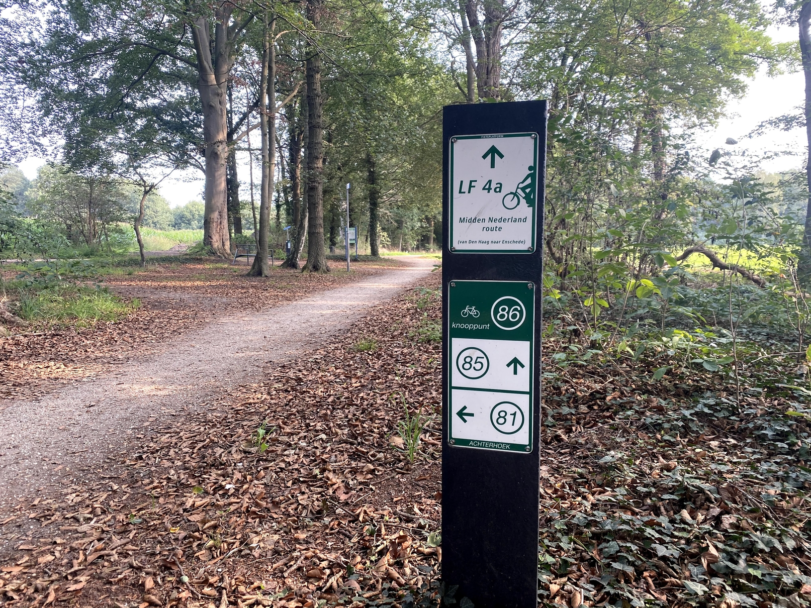
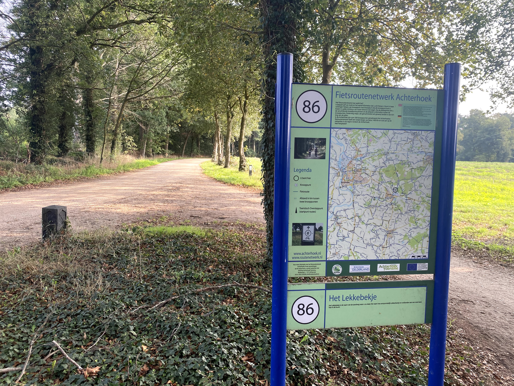
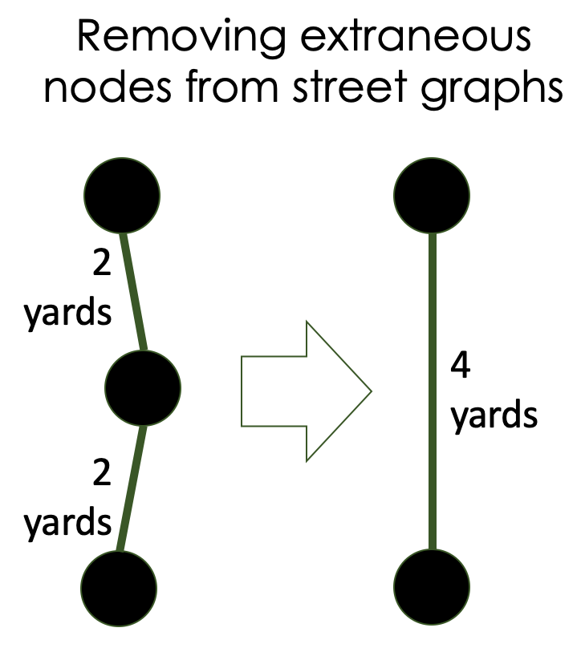
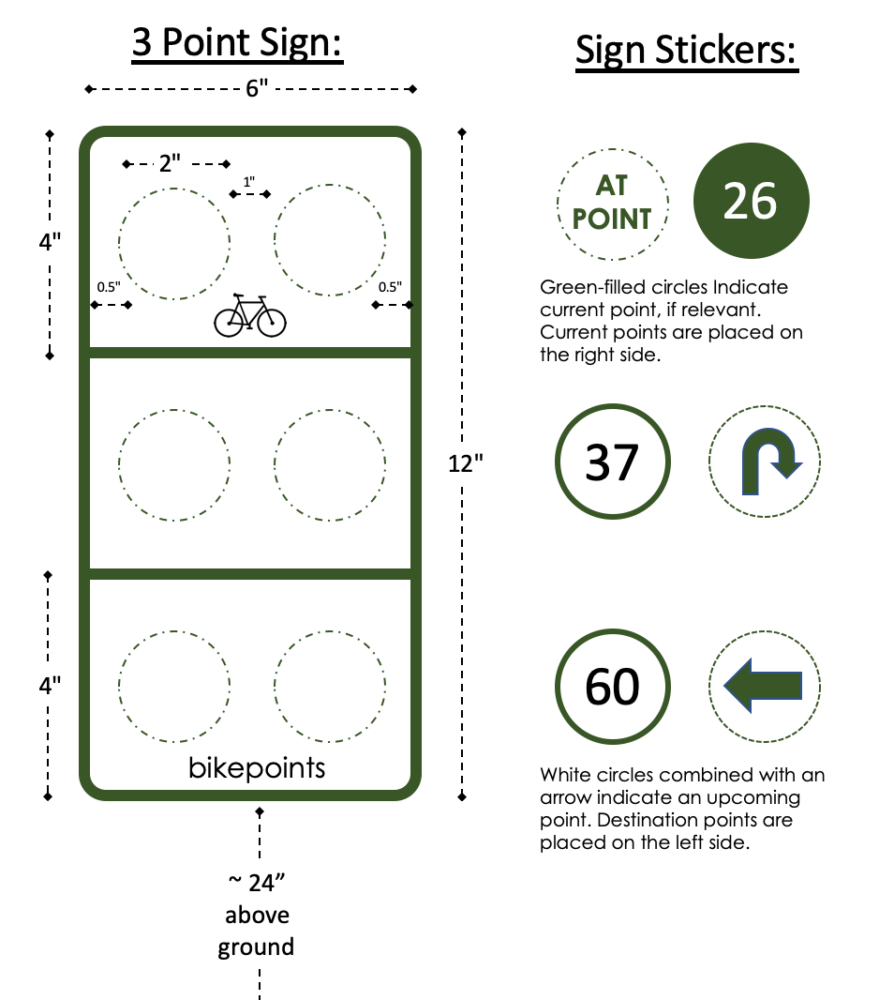
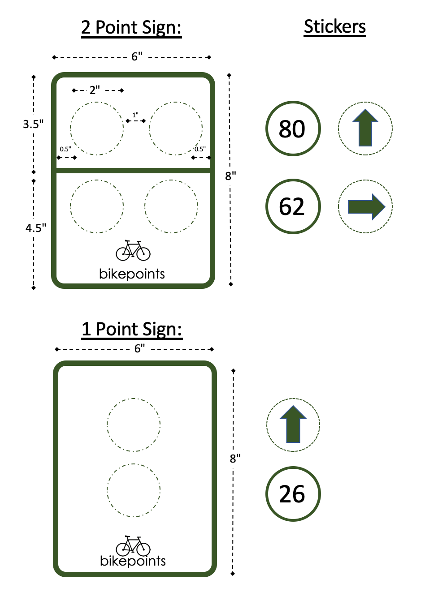
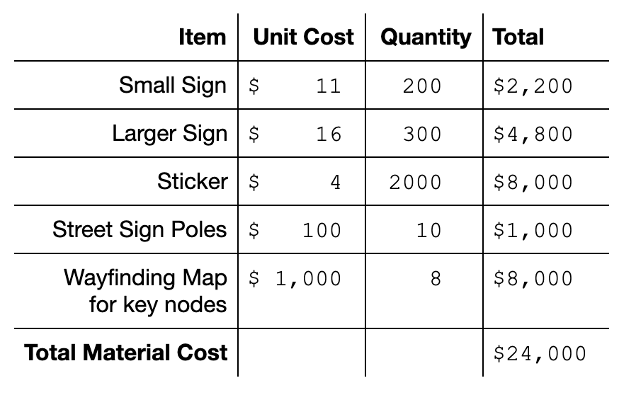

*by [Albert Carter](https://albertrcarter.com) and [Alex Crompton](github.com/cromptone). You can also find [this piece on medium](https://medium.com/@albertrcarter/a-dutch-import-we-can-all-love-bike-points-cf0f77058c20).*

*Update, October 15, 2020: The City of Cambridge, MA is showing some interest in this, since it fits well into the Cambridge 2020 Bicycle Plan. If you're also interested in this, please encourage them to adopt the proposal. Emails can go to [cddat344@cambridgema.gov](cddat344@cambridgema.gov) and you can find a full [PDF writeup here](./Cambridge_Proposal.pdf).*

<iframe src='https://gfycat.com/ifr/UnacceptableRemorsefulBighornedsheep' frameborder='0' scrolling='no' allowfullscreen width='640' height='404'></iframe>

**On a Friday night, Kelsey Rennebohm lost her balance. She was a 28 years old graduate student at Boston College, biking home on Huntington Avenue. The bus behind her didn’t react in time and hit her. She died. But what if she had been on another street?**

When viewing a map of Boston, it’s easy to get the impression that Huntington Avenue is a vital artery to and from the city. It is... for people in cars, in buses, and in trams. For people on bikes, it’s a death trap. Traffic is fast and the curb is high; narrow lanes are crisscrossed by tram tracks. People on bikes are much better served by nearby paths along the Muddy River or Southwest Corridor.

**We would like to introduce you to bike points**, which are already a runaway success in parts of Europe, and might have saved Kelsey’s life.

# Bike points — signage as an economic driver

Bike points are sets of numbered intersections connected by well-labeled bike routes. As illustrated by the graphic above, they simplify bike navigation while routing cyclists onto a predetermined network of streets and paths.

**Bike points allow people to travel between cities with only a few digits scribbled on their hands,** encourage connectedness within cities, attract new residents to rural areas, and support local businesses like restaurants and hotels. Particularly in the Netherlands, but also in parts of Germany, Belgium, and Croatia, they are already a low-cost economic multiplier.

A point on such a network is shown above. The sign, standing at junction 86 in the Dutch bike points network, indicates that people there can go straight to point 85 or turn left to reach point 81. Most bike point locations do not have maps of the larger network, but the one below  happens to.

In addition to being used by students going to school, commuters going to work, and retirees out for a ride on their electric bikes and wheelchairs, **this particular set of bike points attracts thousands of yearly tourists**, filling the nearby town’s restaurants, hotels, sports equipment stores, ice cream parlors, museums, and campsites. (This has been true even during COVID-19, during which many restaurants have been serving takeaway meals).

**Outside of planning, signage is the network’s only infrastructural overhead.** Installing a bike point system requires no widening of lanes or reductions of street parking.

Bike points make places more livable. They are a fantastic navigational supplement to areas with already extensive bike infrastructure. They are a budget friendly first step for cities and counties looking to bolster their tourism industry, connect with nearby economic centers, or attract new people to the region. And they are an easy tool for traffic engineers to make streets safer while simultaneously increasing their overall bandwidth. **All it takes is a few signs.**

# Case study & Cost estimates

As a case study, we used GIS data, network-generation algorithms, and subject matter expertise from local bicyclists to create a sample map of the Boston/Cambridge area.

**Though the map has only 27 intersections, it provides a high level of regional connectedness.** Further refinement is possible and encouraged; during the planning stages, tweaking junction locations or paths can be done quickly with a revisualization of the results. **We estimate the entire material cost of the signs, poles, and occasional wayfinding maps for this network would be $24,000.** This is roughly 1/10 the cost of purchasing and installing a traffic light.[^1]

# Technical Details

The work took place in four stages:

1. Creating a street-network graph data structure
2. Identifying key intersections
3. Determining connections between intersections
4. Routing between intersections

## 1. Creating a street network graph data structure

Open Street Map provides XML-format exports of street maps. A helpful script allowed us to convert this data into a NetworkX graph. The graph generated by this original parsing was extremely noisy, and filled with extraneous nodes (curves on streets, landmarks, traffic signals…). To help reduce the graph noise and make parsing faster, we wrote algorithms to remove intermediate nodes (nodes that only serve as a bridge connecting two other nodes).

## 2. Identifying key intersections
Identifying key intersections was a challenging task that we only partially completed. While algorithms for centrality exist, some algorithms (pagerank, voterank…) gave poor results in testing, while other measures (eigenvector, betweenness…) performed somewhat reasonably on small datasets, but were not scalable.

We ultimately supplemented our graph with local population information, downsampled nodes, and crafted a local betweenness-centrality algorithm. Our calculations placed weight on population density but took care to have universal connectedness and avoid dead zones. **Our goal was to simulate a large number of possible routes a person on a bicycle might take, so that we could see which paths and intersections they would frequently cross.**

The end result of this effort still required some hand-selection of intersections where bike-nodes should be placed, based on input from Boston area cyclists.

## 3. Determining connections between intersections
Once hubs were identified, we used Delaunay triangulation to determine how these intersections might best be connected. **The goal was to have a clean, uncluttered network that still allowed an easy, more-or-less direct route between any two hubs on the graph.**

An initial triangulation produced a graph with an unnecessarily high number of routes. We pruned the graph by removing direct routes (A -> B) that could be reached through an only-slightly-longer indirect route (A -> D -> B).

<iframe src='https://gfycat.com/ifr/AthleticPoisedAustraliankestrel' frameborder='0' scrolling='no' allowfullscreen width='640' height='684'></iframe>

## 4. Routing between intersections
With a set of street intersections and routes in hand, we used the Google Maps API to get biking directions for the routes.

The street map became a bit messier because of this, but better reflected real-world biking conditions. For example, people on bicycles were routed away from Prospect Street, Cambridge, which is dangerous, towards the relatively calm streets just to the west.

## The human touch — why algorithms aren’t enough

**No algorithm can determine an optimal transit network, and no dataset can replace the knowledge of local cyclists and planners.** Our code benefits from (and needs) human input at every step of its process, from data processing, to intersection selection, to route connection.

*For example, in the attached map, in addition to an unfortunate node number choice, our algorithm routed people onto the gravel path of “Riverway”, on the border of Brookline and Boston. More human input would have allowed it to direct bicyclists to the asphalt only a few feet away. Additionally, it did not initially identify Central Square, Cambridge as an important intersection.*

**For municipalities with existing unconnected biking paths, or for municipalities that would like to direct traffic past restaurants, cafes, or tourist attractions, corresponding nodes and edges can be manually added to the graph and displayed.** The algorithms are designed to scale from small towns to states and beyond.

<iframe src='https://gfycat.com/ifr/JealousRealisticJackrabbit' frameborder='0' scrolling='no' allowfullscreen width='640' height='404'></iframe>

# Cost breakdown
On the map, we counted the number of incoming routes to each bike point (104), along with the number of turns along each route (337). This led us to estimate that the proposed project would require 104 + 377 = 481 (rounded up to 500) signs.

We envision that signs will be in two standard sizes (6” x 12” and 6” x 8”), customized on location with two to six reflective stickers each. At an average of four stickers per sign, we estimate 2000 stickers total. Similarly sized reflective-bead aluminum signs cost between $11 and $16 per piece. Vinyl reflective stickers required to customize the signage cost roughly $4 each.

We also estimate eight stationary wayfinding maps to cover the network’s 27 nodes, at $1,000 per map.

**Our $24,000 estimate does not include labor costs of installation because these costs vary widely by locality, and we do not have good sources of data for them.**

# Next steps — would you like to see a bike network?

If you like the idea of a bike point network, please share this article with your local city, county, or state government, and ask them to start a pilot project. This is not a politically difficult project, but needs a champion, because it's new.

This is currently an unpaid hobby that we would be happy to turn into paid work. **We can offer rough bike network maps of anywhere in the US, data on the location and number of signs needed, and help customizing maps.**

We think it would be best to launch a limited pilot project, and are interested in working with organizations that would like to implement bike points for their constituents.

**Please share this article to help bring low cost and high impact bike point infrastructure to the United States.**

[al@albertrcarter.com](mailto:al@albertrcarter.com) | [github.com/rogertangos](github.com/rogertangos) | [twitter.com/al_carter](twitter.com/al_carter)

[alexander.w.crompton@gmail.com](mailto:alexander.w.crompton@gmail.com) | [github.com/cromptone](github.com/cromptone)

[^1]: Traffic Signals. (2019, November 15). Retrieved September 10, 2020, from [https://wsdot.wa.gov/Operations/Traffic/signals.htm](https://wsdot.wa.gov/Operations/Traffic/signals.htm)
