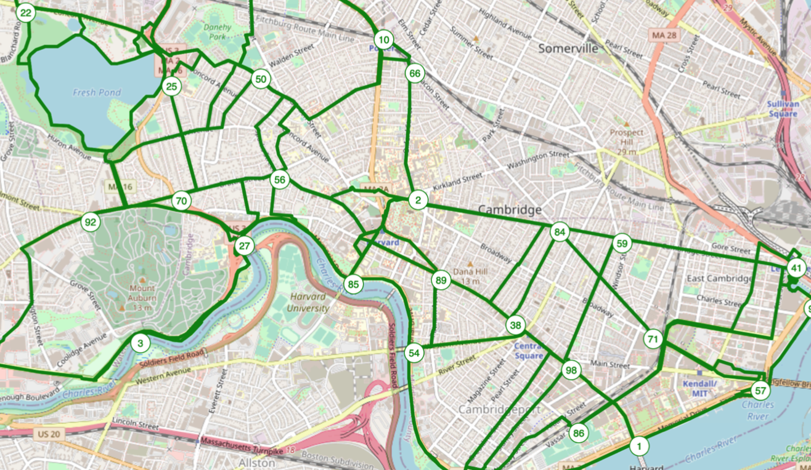
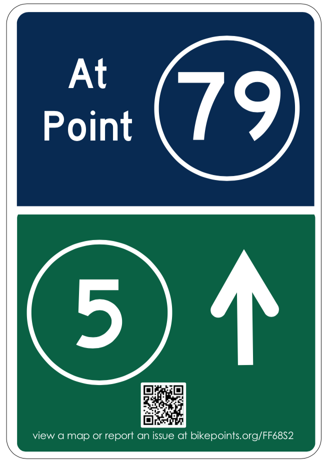

_"BikePoint" wayfinding is an innovative system of wayfinding in widespread use in Western Europe, but practically unknown and unheard of in the United States. A BikePoint wayfinding system is made of many "bike points," which are of numbered intersections connected by well-labeled bike-friendly routes. They simplify bicycle navigation while routing cyclists onto a predetermined network of streets and paths. There is a [more detailed post about BikePoints here.](https://www.albertrcarter.com/bike-points)_

BikePoint wayfinding is more efficient, and easier to use, and requires less physical infrastructure than traditional wayfinding systems. In the United States, it can serve as low-hanging fruit for rapid bicycle and pedestrian transit improvement. In Massachusetts at least, **unfortunately, BikePoint wayfinding also exists in a regulatory and political state of limbo. As a result, after four months of trying to bring BikePoints to the United States, I have put down the project.**

This piece is meant to communicate steps and missteps I took along the way. In the event that someone else decides to pick up the BikePoint or a similar numbered wayfinding project, I hope this can help that person along their way.

## Timeline & Timing
Over the past months, I have taken several steps to try and implement BikePoint wayfinding. My efforts focused exclusively on Massachusetts, where I used to live and can motivate various parts of my social network. This project might have worked somewhere outside of Massachusetts, though that's difficult to know without having tried it.

* August-September, 2020: [Worked on node-finding and route-fitting algorithms](https://github.com/RogerTangos/bikepoints-scratch) for generating BikePoint networks.
* September 14, 2020: [Published this blog post](https://www.albertrcarter.com/bike-points) explaining what bike points are.
* November 10, 2020: Launched the [bikepoints.org](https://bikepoints.org) website.
* November-December 2021:  Reached out to Massachusetts city and county planning authorities and Massachusetts Department of Transportation
* December-January 2020-2021: Reached out to various distribution channels requesting help publicizing BikePoints.

## Implementation Attempts

Considering the infrastructure's low-cost (\$30k in materials and ~100k in labor for a ~120k person municipality) and un-objectionable nature, I reasoned that it would be easier to introduce this concept to the United States via a pilot project, than with a publicity campaign.

As a result, I began this project in a technology driven (and in retrospect, backwards) way. My plan was to algorithmically generate maps of what BikePoint networks, signage, and cost estimates, and then to convince a municipality to trial the program. If all went well, after establishing a pilot project, I hoped that it might be possible to start small business collecting and re-publishing network maintenance data, since this is a significant concern for wayfinding systems.

My first attempts at establishing a BikePoints network were in Cambridge, Massachusetts and the Pioneer Valley area of Western Massachusetts. Both of these areas have young and highly mobile population and affinities for bicycle infrastructure, which I felt to be important to disseminating the idea across the United States. Here's an account of how things went.

### Cambridge, MA Attempt
In Cambridge, MA, despite securing a proponent on the City Council (Thank You Councilor Zondervan!), infrastructure recommendations needed to go from the Cambridge Bike Committee to the Cambridge Planning Department was working from home, and so I was unable to reach them through their office numbers. It also never responded to my emails. This was a bit of a dead end.

The Cambridge Bike Committee, a group of volunteer Cambridge-based bicycle advocates might have been friendly to the idea, but met at 7pm EDT/EST. I live in Europe and due to COVID-19, couldn't travel. I was also unwilling to wake up my partner between 1 and 3 am on Tuesdays so that I could video call from our one-room apartment. I wasn't going to be meeting them anytime soon.

(If you're on the Cambridge bike committee or interested in cycling and way finding in Cambridge, the bike committee might be an angle to try.)

You can find a copy of my proposal to Cambridge, MA [here.](./Cambridge_Proposal.pdf)

### Pioneer Valley, MA Attempt (Amherst, Franklin County, Montague, Northampton)

In Pioneer valley, I elected to try and contact planning departments directly to see whether I could interest them in the idea. I reached out to Amherst, Montague, and Northampton. All departments responded, with Amherst most interested. (Ben Breger in Amherst planning, especially, was pleasure to speak with.) Montague planning was difficult to get in touch with due to their small size and pandemic-related logistics. Beth Giannini at the Franklin County Regional Government sent a polite email explaining that they already had a regional wayfinding system planned. Northampton's planning director was extremely unreceptive.

Laura Hanson at the Massachusetts Department of Transportation was also helpful in introducing me to various players, explaining requirements for the grants she knew of, and generally supportive of the effort at large.

After many conversations, it seemed that to move ahead with such a project, I would need to solve several regulatory issues, find a source of funding, and demonstrate grassroots support.

## Regulatory Issues

### Signage
US signage is governed by the Manual for Uniform Traffic Control Devices (MUTCD), which creates consistency across transportation systems. Unfortunately, the MUTCD, whose origins are in the US Highway System, continues to be extremely car-centric. In the MUTCD, non-motorized forms of transit including pedestrians and bicycles often seem to be an afterthought. This is certainly true of bicycle signage, wayfinding included.

To resolve this, and other regional issues, Massachusetts, has its own supplement to the MUTCD and (at the time of this writing) is nearing completion of a supplement section on bicycle wayfinding. Unfortunately for my project, this supplement is meant to govern all bicycle wayfinding on state roads, but is written with only traditional wayfinding in mind. Among other things, the draft regulation mandates aluminum signs, which must be elevated on sturdy poles to deter theft, and then be made proportionally large to ensure visibility at such height.

This would have some beneficial effects, especially for winter navigation. However, it is very different from the Dutch BikePoints network that my project is modeled upon. The Dutch system uses mostly small plastic signs on plastic posts hammered into the ground. Applying the Massachusetts draft regulations would have easily quadrupled BikePoints material costs and more than quadrupled labor costs.

You can find a draft of a mostly MA DOT compliant BikePoints sign design [here.](./MA_DOT_Sign_Design.pdf)

### Jurisdiction
Jurisdiction presented another regulatory issue. In the Pioneer valley area, roads and paths have a wide array of jurisdictions (MA Department of Conservation and Recreation, MA Department of Transportation, various municipalities, and Greenfield county). In order to establish a _network_, I would need to place signs on all of them. COVID-19 had caused various administrators to work from home and I found it quite difficult to get in contact with them.

### Liability
Several officials voiced concerns about liability issues. In a litigious system, bureaucrats were concerned that people might hurt themselves by tripping over knee-height posts, or by running into upright 7 ft tall poles. While the litigation risk may or not have been real, the fear certainly was. This presented an additional barrier to introducing a new signage system.

### Grass-Roots Support Issues
All planning departments wanted evidence of grass-roots support before proceeding with a trial project. I did find this unfortunate, since the cost of an unobjectionable pilot project could be trivially low by public infrastructure standards, but I understand the officials' concerns.

Here, it seemed like my timing and location were particularly problematic. BikePoints is a type of wayfinding that's unfamiliar to the United States, and I, an advocate whose time zone is six hours ahead of EST/EDT, was attempting to introduce it to the public in the middle of a pandemic. Quite simply, I was unable to make most public meetings, which typically happen between 7 and 9pm, or 1-3am Central European Time. I don't believe that creating grass roots support too high a bar for this project to clear, but it was for me. A local advocate could almost certainly do this better.

### Funding Issues
This project could have been funded through either public or private grants. Of the Massachusetts public grant programs that I researched, [MassDOT's Shared Winter Streets and Spaces](https://www.mass.gov/shared-winter-streets-and-spaces-grant-program) and [DCR's MassTrails grant](https://www.mass.gov/welcome-to-masstrails) seemed to be most appropriate. MassDOT grant coordinators I spoke to seemed to be mostly supportive.

## Conclusion
After several months of working on this project, **I realized that what I had envisioned as a primarily a technological problem was in fact a political one; and my political timing was very bad.** In Massachusetts, bicycle advocates had just finished putting together the regulations, plans, political coalitions, and funding required to build bicycle various bicycle wayfinding systems. Very few players wanted to hear about new ways of doing wayfinding if it meant jeopardizing that victory.

**As a remote volunteer advocate, I decided to throw in the towel and step away from the project.**

If you're planning to develop a new system of bicycle or pedestrian wayfinding, I strongly encourage you to look at BikePoint style systems. They have proven to be popular, cheaper, and all around better than more conventional systems of wayfinding and can be a real win for your community.

Of course, if you'd like to discuss this with me, please feel free to reach out. I'm unlikely to pick up the project again, but would be happy to help someone else make sense of a similar endeavor.

