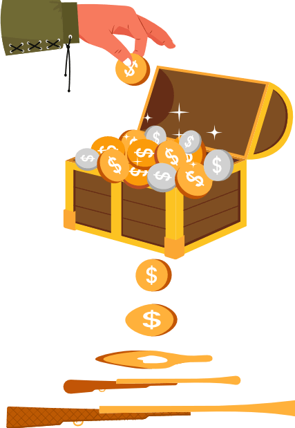

<head>
    <link rel="canonical" href="https://bank.green/blog/cortes-climate-crisis"/>
</head>

_Content warning: violence, sexual assault_

Hernán Cortés' greed knew no bounds. Even after he and his 600 soldiers landed in present-day Mexico, toppled the Aztec Empire, murdered some 100,000 people, raped and enslaved uncounted others, and looted its precious stones, gold, and silver, he wanted more.

He went on to launch a smaller but still bloody expedition to the Baja California peninsula, and followed this with another less ambitious expedition of present-day Honduras. He was thankfully never able to embark upon his dreamed-of Asian conquest.

Cortés' barbarism paid, but his conquests continued to shrink. Why? **His reputation preceded him. He couldn't get new loans.**

Initially, by lending Cortés money, his investors and creditors made possible and even exacerbated one of human history's great atrocities. Later, by refusing to lend to Cortés, they brought his conquests to an end.

When telling the story of Cortés' conquests, we often tell a story about a single greedy man. This story, however, is about money. It is a story about money’s role in enabling Cortés' atrocities and about money’s role in the modern-day atrocity that is the climate crisis. It’s a story that, today, can tell us more than ever.

## This System Funds Atrocities

I am no Cortés, but I have resembled his creditors. Like them, when I sleep, my money does not. Instead, it funds all sorts of things. Some of these things, like schools and public health, are unambiguously good. Others are less so.

[My former bank](https://bankofamerica.com) used my funds to help people buy houses. It also loaned my funds to carbon-belching power plants that will raise the temperature and the sea level, eventually putting those houses and their mortgages underwater.

[One of my alma maters](https://northeastern.edu) prides itself on sustainability and transparency, claiming that its endowment makes the world a better place. It also [routes oil and gas financing secretly through the Cayman Islands](https://www.theguardian.com/news/2017/nov/08/us-universities-offshore-funds-endowments-fossil-fuels-paradise-papers).

My health insurer used my funds to pay for doctor visits. It also used my funds to buy bonds from the fossil fuel company that in 2010 flooded the beach near my home with crude oil, [refused to give cleanup workers protective gear](http://edition.cnn.com/2010/HEALTH/05/31/oil.spill.order/index.html), and left them to endure [seizures, skin lesions, and violent blood-vomiting episodes](https://www.thenation.com/article/archive/investigation-two-years-after-bp-spill-hidden-health-crisis-festers/).

**My money is supposed to protect my future. Instead, it’s being used to fund the destruction of our world and the abuse of its people.** If you have a bank account, it's likely that your money does this, too.

I hate it, and I want to fight back in the most effective ways that I can. **That is why I would like to empower you to regain moral control of your money** – your money, but also your family’s money, your insurer’s money, your pension fund's money, and your government’s money. **By learning from history and applying these lessons to today's atrocities, we can regain control of our moral stewardship and help to build a better world – a world where murderous conquistadors, slavers, animal abusers, coal mines, and oil rigs need not be financed.**

_To regain control of our money and our morals, we must first understand how atrocity is funded and then act accordingly._

---

This is part of an article that I wrote. I'm unable to post it in its entirety on this site, but [you can read the full text here.](https://bank.green/blog/cortes-climate-crisis)