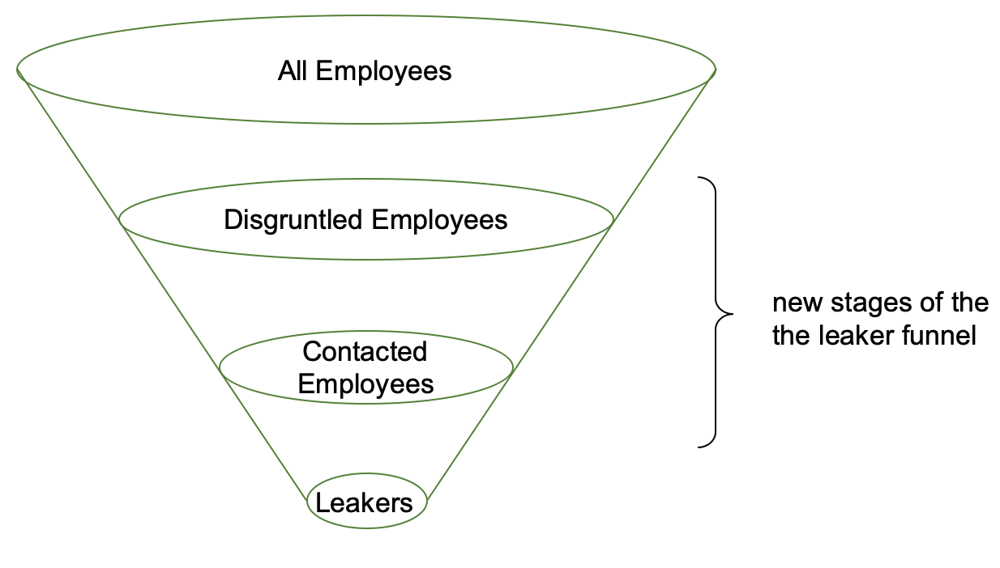

_This is one of a series of potential tactics against fossil fuel companies, meant to limit their ability to supply fossil fuels._

[1. Phishing for Leaks](./leaks-for-liability-against-fossil-fuels) (you are here) | [2. Crashing the Roadshow](./crash-the-roadshow-against-fossil-fuels) | [3. Amplifying Corporate Dissent](./amplifying-corporate-dissent-against-fossil-fuels)

_This campaign is presented in draft form. It would be helpful to know what you think, what you find interesting, and potential issues. **If you have expertise in underwriting, oil or gas drilling, recruiting, or other mentioned fields, and would like to contribute your knowledge, please [contact me](#survey). Industry insiders and insights make these posts possible.**_

---

# 1. Soliciting Leaks for Liability

Exxon Mobil is [under investigation for lying to its investors about the climate crisis](https://www.mass.gov/lists/attorney-generals-office-exxon-investigation).

Shell Oil's [1988 &quot;Greenhouse Effect&quot; memo](https://climateinvestigations.org/shell-oil-climate-documents/) and [1991 climate catastrophe film](https://thecorrespondent.com/6286/if-shell-knew-climate-change-was-dire-25-years-ago-why-still-business-as-usual-today/692773774-4d15b476) are being used by [Dutch climate activists](https://www.theguardian.com/environment/2018/apr/04/friends-of-the-earth-threatens-to-sue-shell-over-climate-change-contributions) in ongoing lawsuits.

The Phillip-Morris tobacco company was laid low by class-action lawsuits, after [internal documents revealed that it schemed to make teenagers addicted to nicotine](https://theoutline.com/post/4382/big-tobacco-knew-way-more-about-addiction-than-it-let-on).

**These lawsuits were made possible by the release of classified documents, proving misdeeds by the company.** In big tobacco's case, [activists leveraged leaked documents to shrink the industry to a fraction of its former size](https://en.wikipedia.org/wiki/Tobacco_Master_Settlement_Agreement). If only there were more leaks…

### A New Way to Induce Leaks

In my [programming career](https://www.albertrcarter.com/resume), I'm messaged by recruiters almost weekly, I receive emails about new tools and services hourly, and I'm advertised to constantly. Despite my past access to politically and legally sensitive information, I've never been asked to leak any of it. (Nor have I leaked any.)

It appears that there are two main ways to leak today:

1. Through a trusted contact, who is likely a journalist.
2. Anonymously, through the mail, or [the internet](http://www.climatedocleaks.com/).

I'd like to supplement the second way. **By reaching out to employees of fossil fuel companies, it should be possible to solicit leaks.**

More fossil fuel leaks can lead to more lawsuits, damaging the companies involved, [making them pay for the damage](https://www.scientificamerican.com/article/cities-sue-big-oil-for-damages-from-rising-seas/)[they've already done](https://www.bostonglobe.com/metro/2018/07/02/faced-with-costs-climate-change-sues-fossil-fuel-companies/mGflVecLlTflLHCmBHYzAM/story.html), and shrinking the supply of fossil fuels that are available to burn, thus benefiting future generations.

Potential leakers working at fossil fuel companies may not _like_ their employer. They may not like their co-workers, or their boss. They may detest the industry, but work in it because they need to provide for their family. Soliciting and facilitating leaks from them can help them affect change.

### Logistics

Here's a sample to-do list to solicit leaked documents:

1. **Put together a website detailing allegations against a company, and asking people to leak relevant documents.** Columbia University maintains a [search-able database of climate litigation](http://climatecasechart.com/) that can be helpful with finding relevant allegations. Users of the website might be able to submit documents via email, via simple file upload, or via a [secure digital drop box](https://securedrop.org/), or through a post office box. You might also use the website to sow corporate dissent, or solicit collaborators for your project.
2. **Advertise to employees.** This could use LinkedIn, Facebook, and/or Google ads. Because of the limited audience size, an advertising campaign should be relatively cheap. (I'd guess around \$300). It might be possible further lower spending by advertising only to [employees that seem dissatisfied, are looking for other work, have recently been furloughed/fired, or that have relevant interests](https://www.facebook.com/business/ads/ad-targeting). For extra effect, it may be possible to use [LinkedIn recruitment tools](https://business.linkedin.com/talent-solutions/recruiter) (\$50-\$100 / month) to directly solicit leaks, or to [harvest emails](https://en.wikipedia.org/wiki/Email-address_harvesting) from the organization and then contact employees that way.
3. **Screen, clean, and categorize documents.** Someone will need to do the screening, categorization, and cleaning of documents. It would be harmful to accidentally expose a leaker's identity.
4. **Share documents with relevant activists/attorneys.**

### Notes and disclaimers

- **This might be funded by a legal agency engaged in litigation against fossil fuel companies.** (Hello, lawyers!)
- This campaign tactic is **inspired by** the many marketing funnels I've seen, and the many recruiters who message my LinkedIn in-box and personal email address.
- The **legality** of this sort of campaign would likely depend on the local laws.
  - Bulk-mailing people found from an email-harvesting operation is almost certainly illegal.
  - I haven't looked into other legal issues, but welcome your thoughts.
- As far as I can tell, **this sort of campaign doesn't yet exist**.
- I have not and will not work on a campaign of this type unless I could be assured of its legality.

---

_This is one of a series of potential tactics to use against fossil fuel companies, meant to limit their ability to supply fossil fuels._

[1. Leaks for Liability](./leaks-for-liability-against-fossil-fuels) (you are here) | [2. Crashing the Roadshow](./crash-the-roadshow-against-fossil-fuels) | [3. Amplifying Corporate Dissent](./amplifying-corporate-dissent-against-fossil-fuels)

---

# What do you think?
<iframe src="https://docs.google.com/forms/d/e/1FAIpQLSf6yAaSzKE1FuO6nQQX882V36upqQJ3_OXj9NanSFSCxU3_yA/viewform?embedded=true" width="640" height="1722" frameborder="0" marginheight="0" marginwidth="0">Loading Survey…</iframe>
