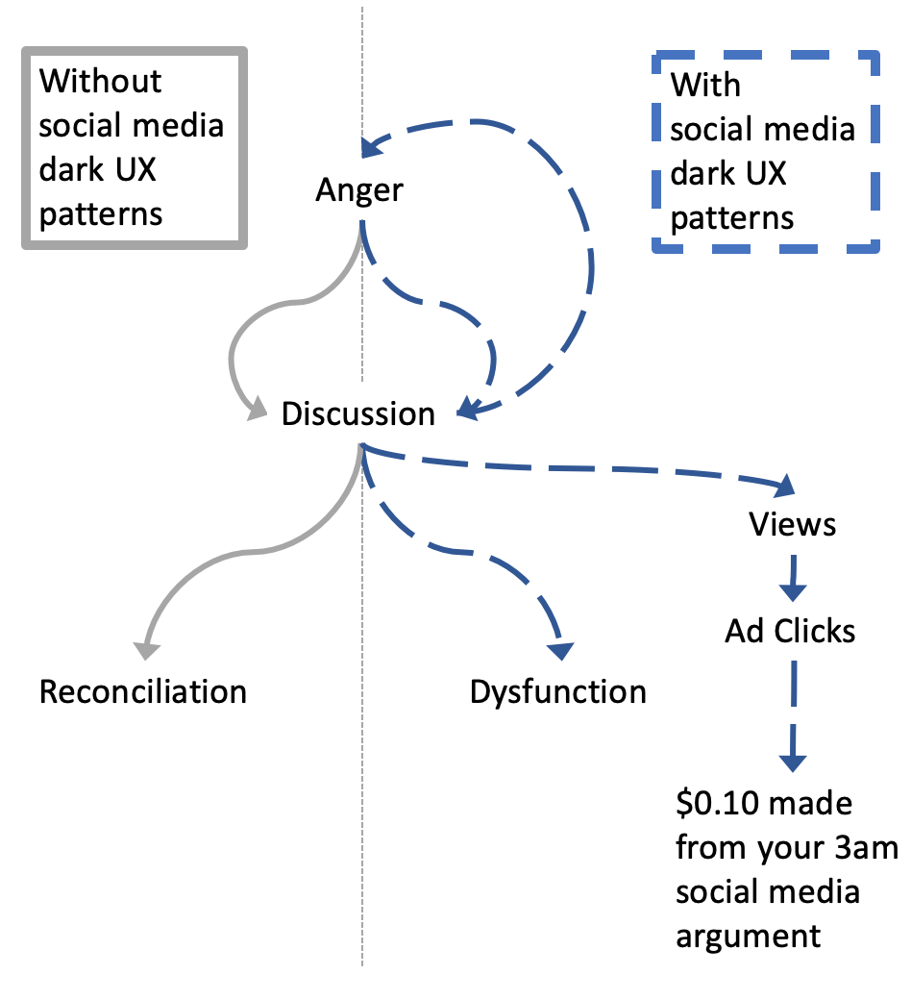
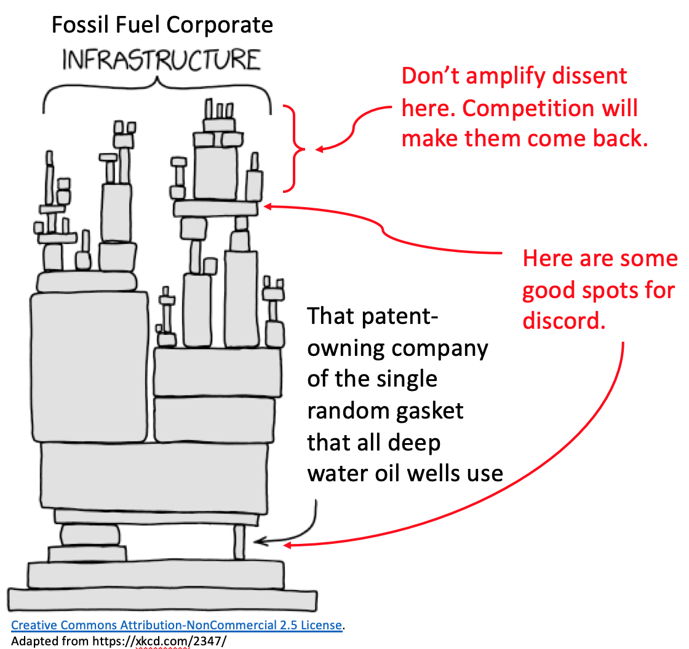

_This is one of a series of potential tactics to use against fossil fuel companies, meant to limit their ability to supply fossil fuels._

[1. Leaks for Liability](./leaks-for-liability-against-fossil-fuels) | [2. Crashing the Roadshow](./crash-the-roadshow-against-fossil-fuels) | [3. Amplifying Corporate Dissent](./amplifying-corporate-dissent-against-fossil-fuels) (you are here)

_This campaign is presented in draft form. It would be helpful to know what you think, what you find interesting, and potential issues. **If you have expertise in underwriting, oil or gas drilling, recruiting, or other mentioned fields, and would like to contribute your knowledge, please [contact me](#survey). Industry insiders and insights make these posts possible.**_

---

# 3. Amplifying Corporate Dissent

The 2016 election and aftermath was characterized by [divisive trolling.](https://www.washingtonpost.com/politics/2016/live-updates/general-election/real-time-updates-on-the-2016-election-voting-and-race-results/how-the-trolls-won-2016/) The trolls were [sloppy](https://www.nytimes.com/2020/01/10/us/politics/russia-hacking-disinformation-election.html), [cheap, and loosely affiliated](https://www.theatlantic.com/technology/archive/2018/02/the-russian-conspiracy-to-commit-audience-development/553685/). They were also extremely effective at widening division and crippling the United States' political machinery.

**What happens when fossil fuel company office politics go online?**

[Social Media is designed to make you angry](https://slatestarcodex.com/2014/12/17/the-toxoplasma-of-rage/). Anger drives discussion ([even context-less discussion!](https://www.computing.dcu.ie/~humphrys/Turing.Test/08.chapter.html)), and discussion drives views, which create clicks, which result in Facebook, Twitter, Tumblr, and other social media companies making $0.10 off of your enraged 3am keyboard-smashing. As a result, social media is an excellent place to sow division within an organization.

In the real world, people eventually de-escalate their anger. In social media, that circuit-breaker is jammed, because it's more profitable that way.

**What if this happened to an essential company in the fossil fuel supply chain?**

Amplifying dissent in _essential companies_ within the fossil fuel value chain, can lead to sector wide slowdowns, preventing fossil fuels from being extracted and burned, while other, cleaner energy alternatives take their market share.

### Logistics

Here's a sample to-do list to amplify corporate dissent:

1. **Identify a fossil fuel target and topic of dissent.** Companies who are essential to the fossil fuel supply chain and have ongoing scandals, difficulties, or different decisions are good candidates.
2. **Start two or more Facebook groups taking sides.** You'll want to use separate profiles for each group.
3. **Create low quality memes mischaracterizing other opinions.** [These](https://www.reddit.com/r/MemeTemplatesOfficial/) [websites](https://www.reddit.com/r/MemeEconomy/) can [help](https://imgflip.com/memegenerator).
4. **Invite employees and former employees.** Employee lists can be found by searching for other company-related groups and posts. A small advertising budget (~ $50) can also go an extremely long way.
5. **Routinely upload new inflammatory content.** Some initially posting can artificially move the discussion forward, before it moves itself.

### Notes and Disclaimers

- **This might be funded by** short-sellers who would benefit from a company's crack-up, or by renewable energy competitors. (Hello hedge funds and renewable energy infrastructure players!)
- This is **inspired by** the Russian troll campaign which would (does?) set up protests and counter-protests on opposite sides of the street, hoping people get violent.
- **I think that this is legal to _do_** , but might be considered stock manipulation to _fund_.
  - People are allowed to have opinions about corporate decisions.
  - Social media companies may publicly approve, but their [UX supports it](https://qz.com/1058674/facebook-news-feed-design-and-dark-ux-are-turning-us-into-sleep-deprived-internet-addicts/).
    - This is similar to the many companies that[_speak_](https://corporate.exxonmobil.com/Energy-and-environment/Environmental-protection/Climate-change/Statements-on-Paris-climate-agreement) [in favor of anti-pollution legislation](https://corporate.exxonmobil.com/Energy-and-environment/Environmental-protection/Climate-change/Statements-on-Paris-climate-agreement), but [_donate_](https://en.wikipedia.org/wiki/List_of_members_of_the_American_Legislative_Exchange_Council#Private_enterprise_board) to [groups undermining it](https://en.wikipedia.org/wiki/American_Legislative_Exchange_Council#Energy_and_the_environment).
  - Make sure not to slander non-public figures.
- **I'm not aware of environmentalists having done this before.**
- The targeted organization would need to be essential to the fossil fuel supply chain in some way
  - In targeting a company with many competitors, activists would only be replacing one minion of the climate crisis with another.
  - e.g.: Don't go after Shell, BP, or Exxon with this tactic. Instead, it's better to go after something strange, technical, and irreplaceable. I haven't looked into it much, but Halliburton might be a good option.

- You may also have internet troll friends who can help.
- I'm too earnest to be a good internet troll, so don't ask me to do this.

---

_This is one of a series of potential tactics to use against fossil fuel companies, meant to limit their ability to supply fossil fuels._

[1. Leaks for Liability](./leaks-for-liability-against-fossil-fuels) | [2. Crashing the Roadshow](./crash-the-roadshow-against-fossil-fuels) | [3. Amplifying Corporate Dissent](./amplifying-corporate-dissent-against-fossil-fuels) (you are here)

---

# What do you think?
<iframe src="https://docs.google.com/forms/d/e/1FAIpQLSf6yAaSzKE1FuO6nQQX882V36upqQJ3_OXj9NanSFSCxU3_yA/viewform?embedded=true" width="640" height="1722" frameborder="0" marginheight="0" marginwidth="0">Loading Survey…</iframe>