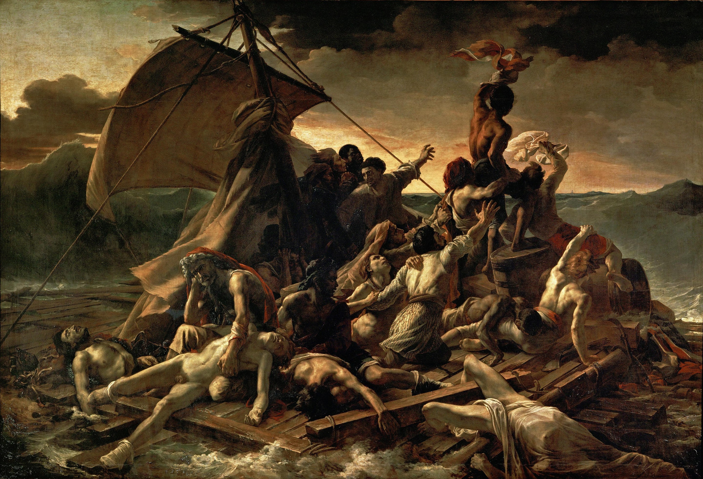
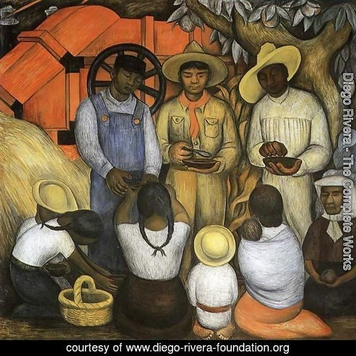

I was recently involved in designing a governance structure for the intentional ecological community in which I live. This is an overview of that structure followed by a translated and heavily edited version of the structure itself.

---

_For context, the eco-village is about 90 multi-generational mostly low-income people (60-ish adults) with separately doored apartments and houses living in the suburbs of a small Dutch city. We're integrated into our greater community through work, friendships, hobbies, and utility grids and intend to stay that way. Our roofs are covered in solar panels and also collect rain water for the washing machines and the garden. Our buildings' insulation lowers the heating bills and keeps our homes warm and toasty in the winter. There are many communal spaces including a big regenerative garden, fruit forest, large kitchen, community pantry, meeting + music rooms, a wood shop + bicycle shed, trampoline, hammock, guest room, outdoor pizza oven, chickens, and a sauna. We also share vehicles and many smaller things through a chat group. One of our missions is to encourage people to organize other intentional communities._

_The land and buildings are owned and was developed by the local public-private housing corporation and the community, a nonprofit entity, and has a 30-year lease on it._

_The neighborhood we're in is mostly suburban cookie-cutter market-price new housing and I believe that one of the requirements of new construction was that it come with a certain amount of affordable housing. While people often think that affordable housing will bring down their property values, affordable *eco* housing seems to have an entirely different ring to it._

_At the moment, the neighbors, whom are mostly recent transplants to this newly developed area, are generally pleased that we provide a beautiful garden and pseudo-public spaces and events that break the region's monotony. The developer and municipality, meanwhile, are happy to unload property management duties onto us as long as the actual public spaces stay open to the public. Though both the developer and municipality have provided some levels of financial support, from their perspectives, this remains a cost saving measure that generates positive externalities._

_After 30 years, the developer will own one of the more beautiful pieces of land in the area, bordering a municipally owned fruit forest. It's unclear whether the developer will renew the lease and if so, under what terms, but that's a problem for another time._

---

**The initial impetus for this new governance structure the collapse of our all-important, "middle circle," driven by the simultaneous resignation all but one of its member. Resigning members cited personal burnout, unclear vision, and structural issues within our system of governance.**

I was part of the resulting working group to propose a new community vision and structure and was most involved with the structural side of the group. To this end, we identified problems by extensively surveying the community, both in written form and through a series of community gatherings. This led us to identify the problems in our (now former) structure as well as potential solutions:

## Problems

Our previous consent-based [sociocratic](https://en.wikipedia.org/wiki/Sociocracy) decision-making system presented a number of problems that people familiar with intentional communities will immediately recognize:

1. Slow, convoluted, and haphazard processes that tended to push decisions to the highest possible levels
2. A general lack of accountability
3. Individuals' ability to block governance activities at inopportune times
4. A relative lack of punishment mechanisms for misbehavior
5. An inability to justly determine active and inactive community members
6. An inability to prioritize projects

## Solutions

Our overarching goal in proposing a new organizational system was to make it easier to work within the community structure than to work around it. The design criteria we formed our new governance structure around are as follows:

1. Separate consent based policymaking powers from representation and mandate based decision-making powers
2. Make decision-making fast, pushing it to the lowest possible structural levels
3. Establish a periodic process for prioritizing and understanding trade-offs between projects
4. Ensuring everyone's voice is heard

### Separating rule making and decision-making
In a living community, there are very few sorts of graduated sanctions (punishments) that we were able to apply for misbehavior or misdeeds. Eviction, the most formal punishment mechanism available, is only usable in the most egregious of circumstances. Minor punishments like doing chores or being excluded from social spaces can breed resentment. What's more, the person being punished may not comply. As a result, the most common form of punishment is directing anger at the perpetrator. This sometimes works as a deterrent but does little post-facto good.

The result is that in order for rules to be universally followed, they must first be universally agreed upon. 

Separating rule making from decision-making allowed us to ensure consent for new rules, but put decision-making processes into a separate faster-track process.

### Decision-making at lower levels of power

Decision-making power, unlike rule-making power, is often best delegated to representatives and expert groups. Decision-making groups, "CIRCLES," in the document below, can have clearly delineated boundaries. This allows groups to make decisions and take actions without external input or kicking the problem up to higher levels.

### Periodic prioritization

Without a clear distinction between contributors and non-contributors to our communal spaces, we instead devised a low barrier to entry on-ramp for our non-active members. 

This periodic event also helps community members prioritize and understand the trade-offs between different projects.

### Electing Representatives

Representatives in this system are rarely asked to make decisions. Their purpose is largely to interpret rules and mediate between decision-making groups.

We use ranked choice voting, also known as instant-runoff voting, to elect representatives. This helps members elect to consensus candidates while also ensuring that minority voices are heard.

## Applications of this structure
I estimate that this governance model can would work well for intentional communities of 50 to 400 adults. With some modification, it might scale to between 30 and 1000. The structure was passed by unanimous consent within my community and I believe that it's vastly superior to the sociocratic structure that we previously had.

I've included a translated and heavily edited version of our new governance structure below and hope that this can help your community. Editorialization is in *italics.*

Our structure, in addition to being adopted before resolving some issues, had to be converted into a series of amendments to existing Dutch legal documents. The edited and translated version is much easier to read, even with the typos... Sorry about those.

People who want help designing their own structure or adopting this one can contact me at [first two letters of my first name][followed by the at sign][followed by this domain of this website].

---

# STRUCTURE AND ORGANIZATIONS WITHIN THE COMMUNITY

THE COMMUNITY governance is composed of 1) a BOARD, 2) self-managing CIRCLES and WORKING GROUPS) 3. PROCESS SUPERVISORS, 4) periodic COMMUNITY DAYS, and 5) General Members' Meetings (GMMs).

In principle, policymaking is based on community-wide consent while decision-making is based on mandates. PROCESS SUPERVISORS help interpret mandates. THE BOARD may, in specific circumstances, override mandates and existing community rules to quickly make decisions. COMMUNITY DAYS function as periodic community touch-points for project prioritization.

## 1. GOVERNANCE AND THE BOARD
The General Members Meeting (GMM) elects 4 BOARD members, including a TREASURER and a CHAIRPERSON, for a term of 2 years. BOARD members are limited to two consecutive terms, after which they must not serve on THE BOARD for one year until running for re-election again. Two BOARD members are elected per year to ensure continuity.

The TREASURER works closely with the finance CIRCLE and the administration WORKING GROUP.

### THE TASKS OF THE BOARD ARE:

<ol type="a">
  <li>Organizing GMMs</li>
  <li>Encouraging CIRCLES to fulfill their mandates</li>
  <li>Maintaining and updating an organisational chart, mandates and internal regulations</li>
  <li>Prioritizing projects and ensuring that they are compliant with THE COMMUNITY vision and mission</li>
</ol>

In exceptional cases, the PROCESS SUPERVISORS may give THE BOARD power to make a community-wide decision on a particular topic. In these cases, THE BOARD may override mandates and community rules to make this decision. If PROCESS SUPERVISORS have given THE BOARD this power, THE BOARD must then inform THE COMMUNITY of this at the next GMM or earlier if possible, even if THE BOARD did not choose to use this power.

*This structure intentionally attempts to prevent THE BOARD from making decisions whenever possible while maintaining a gated construction through which THE BOARD can still on special occasion making these decisions. In a previous structure, THE COMMUNITY found that an all-powerful BOARD led other decision-making bodies to shift responsibility up, eventually leading members of the previous construction of THE BOARD burning out and resigning en masse.*

## 2. CIRCLES AND WORKING GROUPS
THE COMMUNITY is organized into CIRCLES. Each CIRCLE has a defined range of tasks and a mandate, given by the GMM. Within that mandate, the CIRCLES are allowed to make their own policy and decisions. When mandates are unclear or uncertain, CIRCLES may seek interpretation from PROCESS SUPERVISORS. Proposals for new CIRCLES and CIRCLE mandate changes must be submitted to the GMM, preferably in consultation with PROCESS SUPERVISORS. Any changes must be included in the organizational chart maintained by THE BOARD. 

THE COMMUNITY has the following mandated CIRCLES:

1. facilities
2. housing
3. garden 
4. barn
5. co-op (pantry)
6. welfare and wellbeing
7. communication
8. finance
9. COMMUNITY DAY facilitation
10. administration

*Community day facilitation is technically a working group at the moment, but will likely become a CIRCLE in the future*

WORKING GROUPS are groups of people who come together to work on a concrete and finite task. They may function as part of a CIRCLE, within that CIRCLE's mandate or function independently of a CIRCLE. WORKING GROUPS do not have their own community mandates. CIRCLES may block WORKING GROUPS' activities and decisions within those CIRCLES' mandates.

Each CIRCLE and WORKING GROUP has a coordinator. The coordinator is primarily the point of contact, takes responsibility for the functioning of the CIRCLE or WORKING GROUP, and maintains contact with THE BOARD. A coordinator is chosen every 2 years by the CIRCLE or WORKING GROUP.

Trust in the CIRCLE exists by virtue of information sharing. Each CIRCLE sends a delegation to each COMMUNITY DAY to report on the current themes and proposals that are being worked on. WORKING GROUPS may do the same. When a CIRCLE or WORKING GROUP's decisions affect the entire community, the CIRCLE or WORKING GROUP must seek broad support for that decision, preferably by adding an item to THE COMMUNITY weekly mail.

*CIRCLES and WORKING GROUPS have little prescribed structure. They are largely self-governing and typically operate on a consensus basis. While it is possible to imagine people staging a sort of coop and maliciously declaring themselves part of a CIRCLE, given the close-knit nature of THE COMMUNITY, the coop'd CIRCLE's decisions would probably be disregarded as illegitimate and/or cause a minor constitutional crisis of sorts.*

## 3. PROCESS SUPERVISORS

The GMM elects three PROCESS SUPERVISORS fixed terms of one year each. Only one PROCESS SUPERVISOR is elected at a time, in each of GMMs. Once a PROCESS SUPERVISOR has fulfilled their term, they may not be elected again until at least four months after their previous term has ended.

PROCESS SUPERVISORS are guardians of the mandate-driven decision-making process. 

As such, they do the following:
<ol type="a">
	<li>clarify ambiguity and overlaps in CIRCLES' mandates, in consultation with the parties involved.</li>
	<li>advise individuals and groups on how to best follow community processes, so that an initiative or proposal can be linked to sufficient support in THE COMMUNITY. </li>
	<li>suggest changes to group mandates and process at the GMM</li>
	<li>report on their considerations, advice, and decisions at COMMUNITY DAY</li>
</ol>

Some example advice that PROCESS SUPERVISORS might give includes the following:

*  to discuss a proposal with a CIRCLE
*  to set up a new WORKING GROUP
*  to organize a poll on a COMMUNITY DAY
*  to organize a village meeting
*  to bring an issue to the GMM
*  to implement a plan without further consultation
    * PROCESS SUPERVISORS might advise this last point in cases in which an action or decision would likely have a low impact on THE COMMUNITY

In exceptional cases and on individual topics, the PROCESS SUPERVISORS may, with mutual consent, give THE BOARD the power to make overriding decisions or take actions outside THE COMMUNITY rules and mandates. (This is possible, for example, when issues cannot be discussed at COMMUNITY DAY or the GMM due to privacy legislation.) Once the PROCESS SUPERVISORS have given THE BOARD this power on an individual topic, it may not be revoked.

*PROCESS SUPERVISORS work as advisors and enablers, helping individuals and groups establish their right to take certain actions or make certain decisions. This is meant to be one of the things that makes it easier for people to work through THE COMMUNITY structure than around it.*

## 4. COMMUNITY DAY

COMMUNITY DAYS are opportunities for THE COMMUNITY to exchange information and prioritize tasks and may also contain optional trainings and workshops. They are organized and facilitated by a "facilitation" CIRCLE and take place every two months. 

During a COMMUNITY DAY, CIRCLES, WORKING GROUPS, THE BOARD, and PROCESS SUPERVISORS present their actions, decisions, dilemmas, etc. Community members may ask questions and be polled regarding both their opinions on these decisions and on how to prioritize future tasks and projects. No decisions made during COMMUNITY DAYS, since this is done within CIRCLES, and in certain cases, by the GMM and THE BOARD. 

At a COMMUNITY DAY, one or more facilitators from the facilitation CIRCLE ensure that everyone has their say, that there are no unnecessarily long discussions, and that it is clear how people can follow up on topics. Facilitators must share the minutes via the weekly mail within one week of the COMMUNITY DAY.

*In addition to exchanging information and prioritizing tasks, COMMUNITY DAY establishes a community pulse and provides an easy on-ramp to community members who have recently been less active. A formal forum for information exchange (without decision-making) helps limit the number of topics brought to the GMM.*
 
## 5. GENERAL MEMBERS' MEETING (GMM)

THE BOARD must organize at least three General Members Meeting per year, including a budget GMM meeting in November and a legally require annual GMM no later than March. Other general members' meetings are organized as often as THE BOARD or members deem necessary. THE BOARD must declare GMM and shares the agenda and related documents at least one week in advance of the meeting date.

The main goals of the GMM are
1. to change community rules and CIRCLE mandates
2. to elect BOARD members and PROCESS SUPERVISORS

Most decisions should be made via mandate outside the GMM. However, groups and individuals, in consultation with the PROCESS SUPERVISORS, may bring proposals to be decided upon at the GMM. 

*GMMs often have many members present but do not have a quorum, allowing THE BOARD to call and organize them as often as necessary. Because they can be long meetings, we tried to make decision-making possible to do at GMMs but preferable to do elsewhere.*

## 6. AMENDMENT TO HOUSE RULES AND INTERNAL REGULATIONS

The articles of association of THE COMMUNITY can be amended. Changes to the internal regulations can be submitted to the GMM.

## 8. CONSENT BASED DECISION-MAKING AND ELECTION PROCEDURES

Decision-making takes place in using the consent method unless otherwise decided. This is true at GMMs, on THE BOARD, between PROCESS SUPERVISORS, and in CIRCLES and WORKING GROUPS.

These groups may also decide to vote in different ways. At the GMM, in order to vote in other ways, the facilitator or a PROCESS SUPERVISOR must make a proposal to do so and this proposal must be passed by consent. In smaller groups, those groups must vote with consent to change their voting structure.

Voting with consent means that a decision is only approved if no one has strong and reasoned objections. To give a vote of consent does not mean that the voter agree with everything and have no objections, but simply that they can live with the outcome. (i.e. "I think the decision is good enough for now and safe enough to try.")

Members withholding their consent votes must consider the decision and return to the next meeting improved proposals. Members who are not present at a meeting automatically give their consent.

Below are the steps for various decision-making and election processes.

*The difference between voting consent and reaching consensus is real, but practically unenforceable. The best we could do was make it a cultural issue and place the burden of the next proposal upon anyone withholding their consent.*

### 8.1 GMM CONSENT-BASED VOTING

With consent-based voting, members who do are unable to attend the meeting vote "consent" by default and cannot object. Consent-based voting can be used to make or change rules or to make decisions. Consent based voting follows the process below:

1.	A group or individual submits a proposal can be submitted in writing in advance of a meeting, or creates a proposal at a GMM with the help of a facilitator.
2. Individuals ask questions. The proposal cannot proceed until the facilitator has established the group understands the proposal.
3. Individuals argue over the proposal and form opinions and objections.
4. Attendees can vote their consent or give well reasoned objections. (Non attendees may not object.)
5.	If everyone gives their consent, the proposal is adopted.
6.	If there is a well reasoned objection, the person or people objections objecting can raise must propose an improvement either in the current meeting or next.
7. This procedure is repeated until consent is reached.

### 8.2 GMM DEMOCRATIC VOTING

With democratic voting, members who will not be present at the meeting may another member to vote on their behalf. Democratic voting can be used to make or change rules or to make decisions. Democratic voting follows steps one to three the consent based voting.

4. At some point in this process, the facilitator or a member proposes a democratic election.
  * The democratic voting proposal must make clear what the threshold for a majority is.
  * The democratic voting proposal be passed by the consent based voting process if it is passed at all.
5.  Voting is done by a show of hands or a show of hands, where one can vote 'for', 'against' or 'abstain'.
6. The facilitator counts all votes and announces whether a proposal has been adopted or not. This will be recorded.

*Both consent-based and democratic voting are intentionally cumbersome. These formal methods of decision-making are used mostly by the GMM. In creating this, we considered consent to be necessary for rule making, since only people who consent to rules are likely to obey them. Making decision-making too easy in the GMM would lead to more decisions being taken up there, where it ultimately takes more member time. By making decision-making difficult, we try to push it to CIRCLES and WORKING GROUPS.*

### 8.3 ELECTIONS

With elections, members who will not be present at the meeting may another member to rank candidates on their behalf. The election of BOARD members, PROCESS SUPERVISORS and CIRCLE coordinators is done with a consent round after people are selected through ranked choice voting. The steps below are used:

1.	Agendas for a GMM and CIRCLE meetings with elections must state that election(s) will take place and have a description of the position.
2.	Members may nominate candidates in writing, either to THE BOARD or the CIRCLE meeting. Nominations can also be passed to the facilitator upon arrival at the meeting. Nominees may withdraw their candidacy at any point in this process.
3.	The meeting facilitator announces all nominations. A 10-minute discussion follows. Nominees may answer questions.
4.	Individuals vote by ranking their top candidates for the position on a piece of paper and passing it to the facilitator. (Individuals rank 4 candidates if only one or two positions are being considered. They rank 5 candidates if more positions are considered.)  
5. The election follows a standard instant runoff process:
  * For the 1st person, only everyone's 1st choice is considered. The person most often mentioned as 1st choice is elected. If several people are mentioned as often as 1st choice, the 2nd choice is included.
  * If a second person is elected for the role, the 1st and 2nd votes are added together. If several people are mentioned as often as 1st or 2nd choice, the 3rd choice is included.
  * If it is clear who has been chosen most often, a consent round follows.

*This process actually gives disproportionate weight to minority voices, since some elections are won by multiple candidates and first choice votes often pile onto a single initial candidate and aren't spread elsewhere. That said, the minority voices that emerge still tend to be reasonable.*

### 8.4 MEETING ROLES

For the processes at CIRCLE meetings, GMMs and COMMUNITY DAYS to run smoothly, various tasks are required. There is a facilitator, a heart keeper and a note-taker. The facilitator keeps the agenda, the time, the decision-making process, and the ways of voting. The heart-keeper is aware of whether there is enough time and energy for the entire agenda and stays attentive high, and encourages breaks if necessary. The note-taker takes a summary of the discussion and the decisions taken and then distributes the minutes via weekly mail.

---

If you made it all the way down here, you may be interested in designing a system of governance for your own intentional community. Feel free to contact me at [first two letters of my first name][followed by the at sign][followed by this domain of this website].
