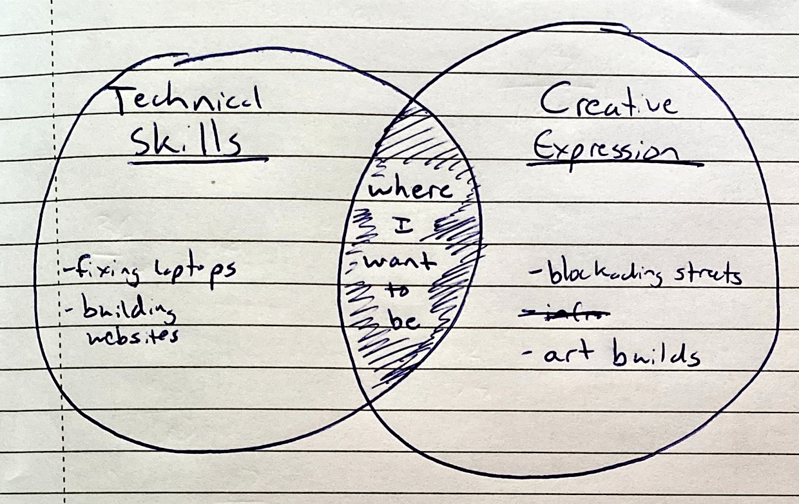

# 📢 June - July Update

It's August, and time for an update on my activist strategy and activities. Because this is  only for own audience, for distribution via email and the website, it's much rougher than other pieces I may put online.

I'm curious to know what you notice about this. There's a <a href="#survey">📋 survey at the bottom of the page.</a>

# Activist Strategies

My strategy for going into and eventually funding my activism as follows:

1. Proving my intentions
2. Teasing potential projects
3. Executing a project
4. Evaluating, refining, and investigating funding

As with other plans, details are lost with distance, so the later steps are a bit blurry.

## 1. Proving my intentions <-- I am here

In activism, my impression is that all people, and especially newcomers, have their own theories of change, opinions, and ideas for campaigns. Unfortunately, newcomers often don't realize the novelty of their ideas, the work that they require, or the resource limitations inherent in volunteer driven movements and organizations that may prevent others from hearing them.

Sometimes, finding a newcomer's ideas unworkable, activists groups will encourage the newcomer to leave. Other times, a newcomer may be discouraged by the group's lack of receptivity, and never return to another meeting. In either case, there's one less person working towards a common cause.

__My blogging is meant to provide proof that I have thought through my ideas, and that I'm willing to put real work into activist campaigns, including those that aren't my own. I hope that this will make me a desirable asset for most groups that I would like to work with.__

## 2. Teasing potential projects (September)

After proving my intentions, I intend to publicize a list of potential projects that make use of my skillset.

I am a technically trained person. My training was expensive, and I would like to see it put to use for causes that I believe in. I also see activism as a forum for self-expression and creativity, requiring space for imagination. My suspicions are that

1. Other people with hard technical and professional skills feel similarly.
2. Activist groups would be well served by attracting professionally and technically trained people
3. Activist groups could better attract these people if they had more interesting work for them to do.

This may all seem vague... I'm writing about making websites and fixing people's laptops, and why I would rather do other things with my time. It's unfortunate but understandable this is where technical activists are often steered. For me at least, it's not best use of my skills, or even what I want to do.

**I see technical and professional skills as a force multiplier and fertile grounds for creativity. Hopefully, a list of potential projects will build credibility for my ideas, help organizers imagine additional types of creative action, and save me from becoming tech support.**

## 3. Execution (September - December)

**I hope to try one or more of my projects to assist an existing organization with an activist campaign.** It's unclear at this point both what project, organization, and campaign this will be. Hence, the brevity of this section.

_I am in contact with some potential activist groups, but would like to finish the aforementioned two steps before jumping onto a campaign._

## 4. Refinement & Funding (December)

After the campaign, I hope to step back, evaluate the results, and plot next steps. There are three possible outcomes here, with differing results.

1. **In the best case, the campaign will have been successful, will have used my professional skills, and will have created clear economic winners.** This outcome may lead me to begin searching for external funding.

2. **In the worst case, the campaign will have been unsuccessful.** This outcome may lead me to either launch another campaign or go back to non-activist programming.

3. **In the muddled case, the campaign will have been successful, though it either will have not used my hard skills or will have not created clear economic winners.** This outcome may lead me to either launch another campaign, go back to non-activist programming, or seek funding from existing activist organizations. Unfortunately, without clear economic winners, external funding will be more difficult to come by.

_This is the end of the strategy section. I would appreciate your thoughts. If you would like, you can skip the "Ongoing Activities" and go straight to the <a href="#survey">survey at the bottom of the page.</a>_

---

# Ongoing Activities
The reporting period goes from June 1 to July 31st. This upcoming period goes from August 1 to September 30.

**In the current period, my effort broke down as follows:**

- **44% Learning Dutch**
- **38% Activism**
- **18% Non-Dutch-Non-Activism-Related** (taxes, paperwork, etc)

## ⏱ Work Schedule

My work day begins at 10am, Central European Time, and ends between 6 and 7:30 in the evening with a 1-hour lunch break. I make extensive use of clubhouse.io and Agile methodologies, in a weekly sprint pattern. A writer friend and I make our plans on Fridays at 10am. We would welcome additional participants.

## 🇳🇱 Dutch
My Dutch is progressing steadily. I have not taken any recent comprehensive tests, but strongly suspect that it has reached or exceeded A1 level. In lieu of testing, currently plan to consider it A1 level once I complete [LearnDutch.org](learndutch.org)'s Beginner Grammar Course, and 100% of Babbel's Vocabulary lessons.  My Estimated completion date for my current course of study is September 15th.

## 🏠 Non-Dutch-Non-Activist Activities
My non-Dutch-non-activist activities have included self-study of a new programming language, Clojure, a text editing tool, Emacs, and writing and mailing a paper letter which many of you received. These activities were more frequent at the beginning of the period, as a result of closed out accounts. I expect Non-Dutch-Non-Activist to stay at their present low level throughout the new period.

## ✊ Activist Activities.

During this period, I spent significant amounts of effort building an online presence, educating myself in finance, and on writing. My piece on pandemics and the environment was [posted in the new Extinction Rebellion global blog](https://rebellion.global/blog/2020/07/22/pandemics-environment/), and I expect to complete a piece or series of pieces on financial activism during the upcoming period.

### 💻 Building an Online Presence
Building an online presence, including building [a website](https://www.albertrcatter.com), building social media accounts, consolidating contact information, and reaching out contacts comprised fully 48% of my activist activities.

### 🏦 Financial Education
During and before this period I have been learning about corporate finance. 16% of my activist activities went to three introductory [corporate](https://dashboard.corporatefinanceinstitute.com/courses/accounting-fundamentals/) [finance](https://courses.corporatefinanceinstitute.com/courses/take/learn-to-read-financial-statements-free-course) [courses](https://dashboard.corporatefinanceinstitute.com/courses/introduction-to-corporate-finance/). Un-accounted amounts of activities also went to reading the [Heretic's Guide to Corporate Finance](https://www.goodreads.com/book/show/17368973-the-heretic-s-guide-to-global-finance), reading the [Financial Times](https://ft.com), and watching [XR's Money Talks series](https://www.youtube.com/playlist?list=PLI0yHz9yiN_uVa3nzA4534406KnDhyWoT)

### 🖋🤒 Writing a Pandemics Piece
I am finding an unfortunate part of writing to be the time spent not writing, but distributing my work. In the case of the recently posted pandemics piece, 60% percent of my writing-related activity was spent _not_ on writing. Within this 60%, 50% was spent editorial work including markdown and html styling and formatting, and even debugging the Extinction Rebellion CMS, and 50% was spent on distribution channels outside of the Extinction Rebellion Global brand.

These non-writing activities have allowed me some accidental activist contacts within the XR Global organization, but are far outside of what I had hoped would be the project's scope.

For future pieces, I hope to minimize this by requesting only two rounds of edits, avoiding certain markdown elements, and setting clear expectations of what is outside of my project scope.

### 🖋💰 Writing a Finance Piece

Much of my financial education has been in support of a blog post I am writing on financial activism. The topic is very large, so I plan to split it into three parts: 1. a background on financing for fossil fuel projects 2. explanation of an ongoing campaign 3. tips and tricks for financial activism.

In the period, I did draft a piece based on the [Money Talks video series](https://www.youtube.com/playlist?list=PLI0yHz9yiN_uVa3nzA4534406KnDhyWoT) and [Heretic's Guide book](https://www.goodreads.com/book/show/17368973-the-heretic-s-guide-to-global-finance), but after conferring with friends working in finance, decided to redraft a new one.

---

# 😯 So, uhh... what do you think? 😯

<iframe src="https://docs.google.com/forms/d/e/1FAIpQLSeUlNXE9iMDWsgKa0Mqt2XGUDyULgC0CjOQk8X6AwmjY27p5A/viewform?embedded=true" width="640" height="2413" frameborder="0" marginheight="0" marginwidth="0">Loading…</iframe>