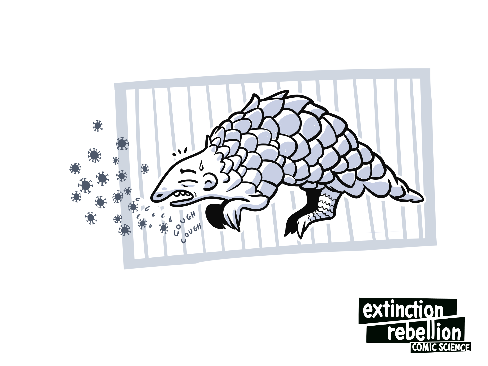
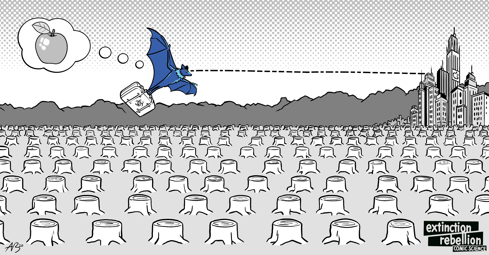
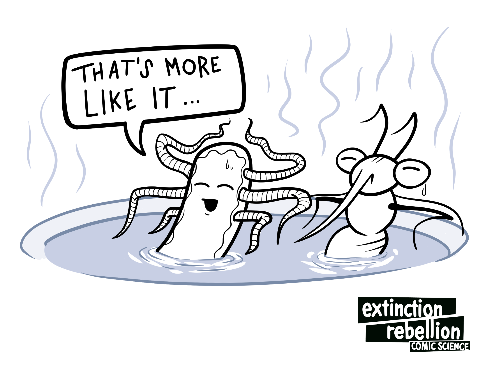
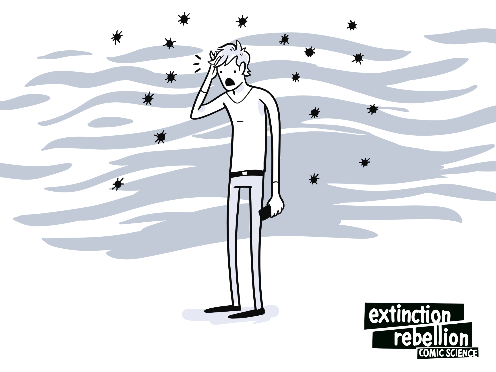
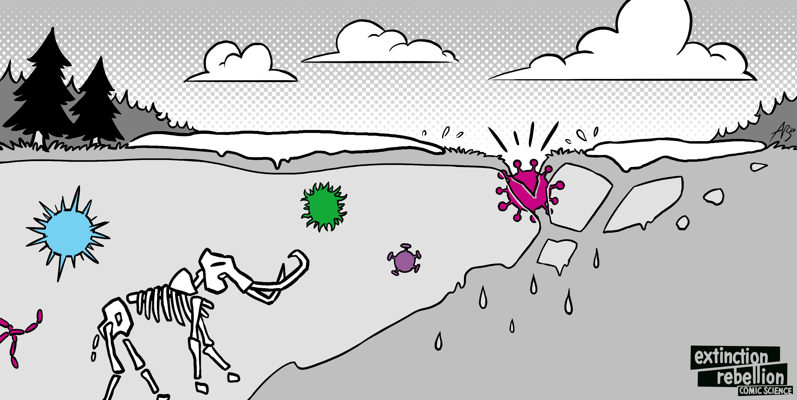

<head>
    <link rel=“canonical” href=https://rebellion.global/blog/2020/07/22/pandemics-environment/” />
</head>

Pandemics, ecology, and climate are hopelessly intertwined. The climate and ecological crisis sickens and displaces both wild animals and human beings. It creates excellent conditions for pests like ticks and mosquitoes to breed as well as for deadly bacteria to multiply. And it literally thaws ancient pathogens from the ground. All of these lead to disease, which, when left unchecked, can result in pandemics.

This post explains some of the less-visible connections between infectious disease and the climate and ecological crisis; how many pandemics begin; and how, by fighting against environmental destruction, we can also play a part in preventing the next pandemic.

# Pandemics Start with Wild Animals

What are some **similarities between COVID-19, SARS, MERS, Ebola, swine flu (H1N1), Lyme disease, West Nile fever, and HIV/AIDS?**

**All of these originated in wildlife before jumping to humans.** The ancestors of HIV/AIDS and Ebola were first identified in chimpanzees, while West Nile fever and swine flu were first found in birds. (Also known as H1N1, swine flu originated in birds, jumped to pigs, and finally got to humans.) The remaining diseases originated in bats.

In the case of COVID-19, there is strong evidence that an infected bat [^Andersen2020] came in close contact with other wild animals (very likely caged and stressed pangolins and civet cats) that were then exposed to, and possibly eaten by, a human who became infected.[^Berger2020] [^Zhang2020] Airplanes and cruise ships then spread the disease worldwide, and the rest is history.

# Wilderness Is a Wall that Keeps out Disease. We're Destroying It.

**In healthy natural environments, wild animals’ diseases circulate mostly in the wild and keep away from humans, with plant and animal diversity shielding humans from infection.**[^Ostfeld2012] [^Swaddle2008] This is largely because the vast majority of wild animals (including the previously-mentioned civet cats, pangolins, and most birds and bats) are afraid of humans and do their best to avoid us. Furthermore, with a multitude of wild animals available to infect, bacteria and viruses have little incentive to adapt themselves to human hosts.

But **when people destroy nature** – cutting down forests to make farm land, criss-crossing wilderness with roads and pipelines, disruptively damming and diverting rivers that wild animals depend on – it kills those animals. **It fragments animal communities, and causes the survivors to be hungry and stressed – becoming perfect incubators for disease. This also encourages those same animals to venture closer to humans** to search for food.

Scientists believe that this is why shrinking wilderness and disease outbreaks go hand in hand.[^Morand2014] [^Jones2008] [^Keesing2010] **Destroying nature sickens wild animals, then brings their contagious diseases to us.**

# The Climate Crisis Strengthens Existing Diseases

Animal-borne diseases like Lyme disease, malaria, West Nile fever, and dengue are already moving into new regions. This is because **longer, hotter summers, warmer winters, and increased annual rainfall cause the ticks, mosquitos, and fleas that carry these diseases to shift habitats, moving into areas that were previously inhospitable to them.** [^Semenza_Suk2017] [^CDC2020]

By way of example, Europe has seen a sharp and shocking spike in West Nile virus infections, after years of record-breaking warmth,[^Burki2018] [^Semenza_Suk2017] while in North America, warmer winters have dramatically expanded ticks’ ranges and made Lyme disease into a household name.[^Sonenshine2018] [^Eilsen_et_al_2015] [^Hahn_et_al_2016]

Like animal-borne diseases, diarrheal diseases like Salmonella and campylobacteriosis too benefit from higher temperatures and extreme weather. This is because warmer temperatures allow bacteria to multiply faster, while extreme weather creates flooding, sewage spillover, and standing pools of water, which all provide prime bacterial breeding grounds. [^Yun2016] [^CDC2020Diarrheal] [^Levy2016]

As the earth warms, **warmer winters no longer kill disease-carrying pests. Warmer and longer summers, flooding, and extreme precipitation provide pests and bacteria more time and better conditions for reproduction. And all of these contribute to the spread of disease.**

# Air Pollution Weakens Our Defenses

Many people know that air pollution worsens asthma and heart disease[^Cohen_et_al_2005] [^Cohen_et_al_2017], but did you know that it also corresponded with deaths from infectious diseases?

**For COVID-19 sufferers, a small increase in a patient's exposure to air pollution was associated with an 8% higher death rate.** This was true even when controlling for patient age, health, and wealth, the availability of healthcare services, the population density where they lived, and patients who used to live in polluted areas but didn’t anymore. Air pollution was also correlated with higher rates of death in the context of SARS[^Cui2003] and pneumonia[^Neupane_et_al_2010].

Air pollution – even when we were only exposed to it as children – gives us a lifetime of higher susceptibility to many diseases. And people who are susceptible to disease are more likely to spread it. **Air pollution has already contributed to the deadliness of the COVID-19 pandemic - it may well worsen the next one.**

# Diseases Will Continue Melting out of Frozen Land

**During a summer heatwave in August 2016, anthrax thawed out of land that we had thought was permanently frozen – the permafrost.** The escaped anthrax killed a 12-year-old boy, infected at least 20 other people, and killed more than 2,300 reindeer in the area. It was the region's first outbreak in 75 years.[^BBC2016-1]

This took place in a remote part of Siberia[^BBC2016-2]. If it had happened in a city (or even an arctic village), the results might have been much worse.

The climate crisis is causing the permafrost to thaw. Fast.[^Farquharson_et_al2019]. And many **people expect pathogens trapped within the previously frozen ground – responsible for such diseases as polio, anthrax, smallpox and the Spanish flu – to eventually be released.**[^Goudarzi2016]

Human prehistory is long. We have no records, strategies, vaccines, or even names for the diseases that plagued our ancient ancestors. **There's no reason to believe that those ancient diseases would be any less infectious or deadly than those we are fighting today.**

# We Can Fight Pandemics

Fighting the climate and ecological crisis means fighting against the destruction of nature. It means fighting against extreme weather, and it means fighting against pollution. It means keeping it in the ground - both fossil fuels, and the frozen pathogens that their burning would release.

It's too late to stop the COVID-19 pandemic from happening, but **by fighting for the environment, you can be part of the fight against the arrival of the next pandemic.**

Extinction Rebellion calls this fight a rebellion. If you are interested in joining us to tell the truth about pandemics, pollution, climate, and ecological destruction. To tell people how and why this toxic system will produce more pandemics.

**Take a small action: The next time you talk about pandemics, bring environmental issues into the discussion, too. They're more relevant than people may realize.**

*Written by Albert Carter and the [Extinction Rebellion Comic Science Working Group](https://xrscience.earth). Illustrations by Comic Science. This piece is also featured on the <a href=https://rebellion.global/blog/2020/07/22/pandemics-environment/” rel=“canonical”>Extinction Rebellion Blog</a>.*

*You can contact the author at [https://albertrcarter.com/contact](https://albertrcarter.com/contact)*

# References

[^Goudarzi2016]: Goudarzi, S. (2016). What Lies Beneath. Scientific American, 315(5), 11–12. [https://doi.org/10.1038/scientificamerican1116-11](https://doi.org/10.1038/scientificamerican1116-11)

[^Neupane_et_al_2010]:  Neupane, B., Jerrett, M., Burnett, R., Marrie, T., Arain, A. and Loeb, M., 2010. Long-Term Exposure to Ambient Air Pollution and Risk of Hospitalization with Community-acquired Pneumonia in Older Adults. American Journal of Respiratory and Critical Care Medicine, 181(1), pp.47-53, [https://doi.org/10.1164/rccm.200901-0160OC](https://doi.org/10.1164/rccm.200901-0160OC)

[^Cohen_et_al_2005]: Cohen, A., Ross Anderson, H., Ostro, B., Pandey, K., Krzyzanowski, M., Künzli, N., Gutschmidt, K., Pope, A., Romieu, I., Samet, J. and Smith, K., 2005. The Global Burden of Disease Due to Outdoor Air Pollution. Journal of Toxicology and Environmental Health, Part A, 68(13-14), pp.1301-1307.[https://doi.org/10.1080/15287390590936166](https://doi.org/10.1080/15287390590936166)

[^Cohen_et_al_2017]: Cohen, A. J., Brauer, M., Burnett, R., Anderson, H. R., Frostad, J., Estep, K., … Forouzanfar, M. H. (2017). Estimates and 25-year trends of the global burden of disease attributable to ambient air pollution: an analysis of data from the Global Burden of Diseases Study 2015. The Lancet, 389(10082), 1907–1918. [https://doi.org/10.1016/s0140-6736(17)30505-6](https://doi.org/10.1016/s0140-6736(17)30505-6)

[^Sonenshine2018]: Sonenshine, D. (2018). Range Expansion of Tick Disease Vectors in North America: Implications for Spread of Tick-Borne Disease. International Journal of Environmental Research and Public Health, 15(3), 478. [https://doi.org/10.3390/ijerph15030478](https://doi.org/10.3390/ijerph15030478)

[^Hahn_et_al_2016]: Hahn, M. B., Jarnevich, C. S., Monaghan, A. J., & Eisen, R. J. (2016). Modeling the Geographic Distribution ofIxodes scapularisandIxodes pacificus(Acari: Ixodidae) in the Contiguous United States. Journal of Medical Entomology, 53(5), 1176–1191. [https://doi.org/10.1093/jme/tjw076](https://doi.org/10.1093/jme/tjw076)

[^Eilsen_et_al_2015]: Eisen, R. J., Eisen, L., Ogden, N. H., & Beard, C. B. (2015). Linkages of Weather and Climate WithIxodes scapularisandIxodes pacificus(Acari: Ixodidae), Enzootic Transmission ofBorrelia burgdorferi, and Lyme Disease in North America. Journal of Medical Entomology, 53(2), 250–261. [https://doi.org/10.1093/jme/tjv199](https://doi.org/10.1093/jme/tjv199)

[^Farquharson_et_al2019]: Farquharson, L. M., Romanovsky, V. E., Cable, W. L., Walker, D. A., Kokelj, S. V., & Nicolsky, D. (2019). Climate Change Drives Widespread and Rapid Thermokarst Development in Very Cold Permafrost in the Canadian High Arctic. Geophysical Research Letters, 46(12), 6681–6689. [https://doi.org/10.1029/2019gl082187](https://doi.org/10.1029/2019gl082187)

[^BBC2016-1]: (2016, August 2) Russia anthrax outbreak affects dozens in north Siberia, BBC News, Accessed 2020, July 8. [https://www.bbc.com/news/world-europe-36951542](https://www.bbc.com/news/world-europe-36951542)

[^BBC2016-2]: (2016, August 2) Russia anthrax outbreak affects dozens in north Siberia, BBC News, Accessed 2020, July 8. [https://www.bbc.com/news/world-europe-36951542](https://www.bbc.com/news/world-europe-36951542)

[^Semenza_Suk2017]: Semenza, J. C., & Suk, J. E. (2017). Vector-borne diseases and climate change: a European perspective. FEMS Microbiology Letters, 365(2). [https://doi.org/10.1093/femsle/fnx244](https://doi.org/10.1093/femsle/fnx244)

[^ECDC]: Epidemiological update: West Nile virus transmission season in Europe, 2018. (2018, December 14). European Center for Disease Control. Retrieved from https://www.ecdc.europa.eu/en/news-events/epidemiological-update-west-nile-virus-transmission-season-europe-2018European perspective. FEMS Microbiology Letters, 365(2). [https://doi.org/10.1093/femsle/fnx244](https://doi.org/10.1093/femsle/fnx244)

[^Andersen2020]: Andersen, K. G., Rambaut, A., Lipkin, W. I., Holmes, E. C., & Garry, R. F. (2020). The proximal origin of SARS-CoV-2. Nature Medicine, 26(4), 450–452. [https://doi.org/10.1038/s41591-020-0820-9](https://doi.org/10.1038/s41591-020-0820-9)

[^Berger2020]: Berger, K. (2020, March 12). The Man Who Saw the Pandemic Coming - Issue 83: Intelligence. Retrieved July 08, 2020, from [https://nautil.us/issue/83/intelligence/the-man-who-saw-the-pandemic-coming](https://nautil.us/issue/83/intelligence/the-man-who-saw-the-pandemic-coming)

[^Zhang2020]: Zhang, T., Wu, Q., & Zhang, Z. (2020). Probable Pangolin Origin of SARS-CoV-2 Associated with the COVID-19 Outbreak. Current Biology, 30(7), 1346–1351.e2. [https://doi.org/10.1016/j.cub.2020.03.022](https://doi.org/10.1016/j.cub.2020.03.022)

[^Ostfeld2012]: Ostfeld, R. S., & Keesing, F. (2012). Effects of Host Diversity on Infectious Disease. Annual Review of Ecology, Evolution, and Systematics, 43(1), 157–182. [https://doi.org/10.1146/annurev-ecolsys-102710-145022](https://doi.org/10.1146/annurev-ecolsys-102710-145022)

[^Swaddle2008]: Swaddle, J. P., & Calos, S. E. (2008). Increased Avian Diversity Is Associated with Lower Incidence of Human West Nile Infection: Observation of the Dilution Effect. PLoS ONE, 3(6), e2488. [https://doi.org/10.1371/journal.pone.0002488](https://doi.org/10.1371/journal.pone.0002488)

[^Morand2014]: Morand, S., Jittapalapong, S., Suputtamongkol, Y., Abdullah, M. T., & Huan, T. B. (2014). Infectious Diseases and Their Outbreaks in Asia-Pacific: Biodiversity and Its Regulation Loss Matter. PLoS ONE, 9(2), e90032. [https://doi.org/10.1371/journal.pone.0090032](https://doi.org/10.1371/journal.pone.0090032)

[^Jones2008]: Jones, K., Patel, N., Levy, M. et al. Global trends in emerging infectious diseases. Nature 451, 990–993 (2008). [https://doi.org/10.1038/nature06536](https://doi.org/10.1038/nature06536)

[^Keesing2010]: Keesing, F., Belden, L. K., Daszak, P., Dobson, A., Harvell, C. D., Holt, R. D., Hudson, P., Jolles, A., Jones, K. E., Mitchell, C. E., Myers, S. S., Bogich, T., & Ostfeld, R. S. (2010). Impacts of biodiversity on the emergence and transmission of infectious diseases. Nature, 468(7324), 647–652. [https://doi.org/10.1038/nature09575](https://doi.org/10.1038/nature09575)

[^Levy2016]: Levy, K., Woster, A. P., Goldstein, R. S., & Carlton, E. J. (2016). Untangling the Impacts of Climate Change on Waterborne Diseases: a Systematic Review of Relationships between Diarrheal Diseases and Temperature, Rainfall, Flooding, and Drought. Environmental Science & Technology, 50(10), 4905–4922. [https://doi.org/10.1021/acs.est.5b06186](https://doi.org/10.1021/acs.est.5b06186)

[^Burki2018]: Burki, T. (2018). Increase of West Nile virus cases in Europe for 2018. The Lancet, 392(10152), 1000. <a href=https://doi.org/10.1016/s0140-6736(18)32286-4>https://doi.org/10.1016/s0140-6736(18)32286-4</a>

[^CDC2020]: Centers for Disease Control and Prevention. (n.d.). Climate Change and Public Health - Disease Vectors | CDC. Climate Effects on Health: Diseases Carried by Vectors. Retrieved May 27, 2020, from [https://www.cdc.gov/climateandhealth/effects/vectors.htm](https://www.cdc.gov/climateandhealth/effects/vectors.htm)

[^CDC2020Diarrheal]: Centers for Disease Control and Prevention. (n.d.). Climate Change and Public Health - Disease Vectors | CDC. Climate Effects on Health: Food and Waterborne Diarrheal Disease. Retrieved May 27, 2020, from [https://www.cdc.gov/climateandhealth/effects/food_waterborne.htm](https://www.cdc.gov/climateandhealth/effects/food_waterborne.htm)

[^Yun2016]: Yun, J., Greiner, M., Höller, C. et al. Association between the ambient temperature and the occurrence of human Salmonella and Campylobacter infections. Sci Rep 6, 28442 (2016). [https://doi.org/10.1038/srep28442](https://doi.org/10.1101/2020.04.05.20054502)

[^Wu2020]: Wu, X., Nethery, R. C., Sabath, B. M., Braun, D., & Dominici, F. (2020). Exposure to air pollution and COVID-19 mortality in the United States: A nationwide cross-sectional study. Cold Spring Harbor Laboratory. [https://doi.org/10.1101/2020.04.05.20054502](https://doi.org/10.1101/2020.04.05.20054502)

[^Cui2003]: Cui, Y., Zhang, Z.-F., Froines, J., Zhao, J., Wang, H., Yu, S.-Z., & Detels, R. (2003). Air pollution and case fatality of SARS in the People’s Republic of China: an ecologic study. Environmental Health, 2(1). [https://doi.org/10.1186/1476-069x-2-15](https://doi.org/10.1186/1476-069x-2-15)
